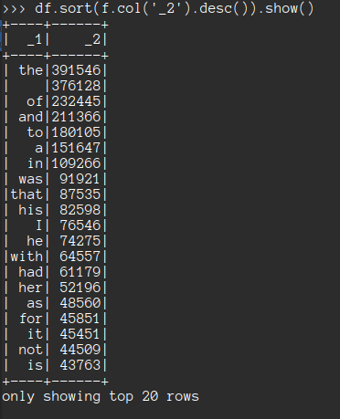
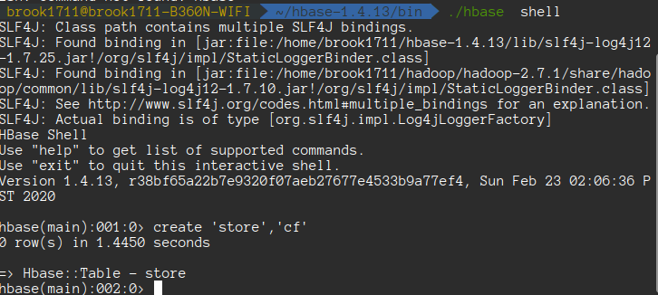
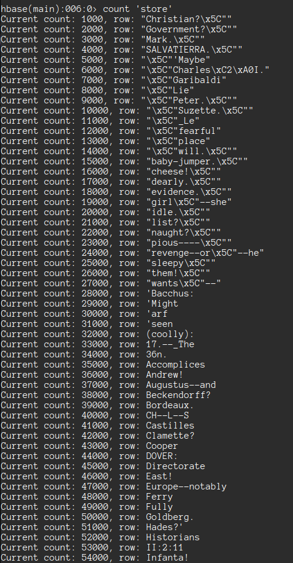
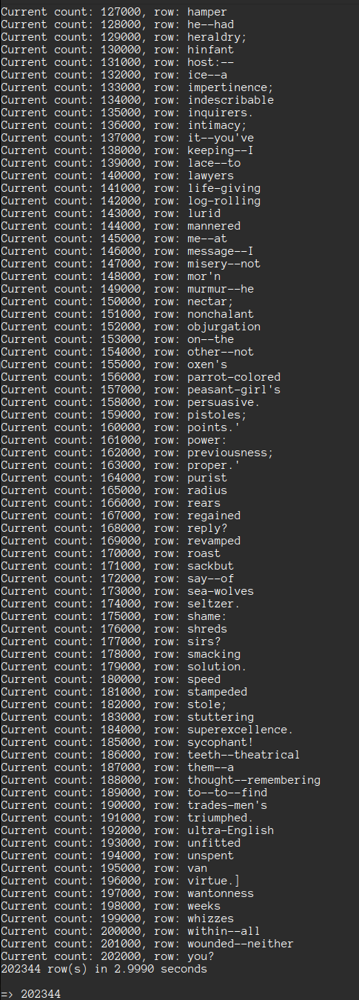

# 实验步骤

## 一、搭建环境

### 1.1 环境介绍

系统平台：ubuntu 20.04 LTS

java版本：jdk1.8.0_271

python版本：3.7.9

spark版本：2.4.7

pyspark版本：2.4.7

hadoop版本：2.7.1

hbase版本：1.4.13

### 1.2 数据集介绍

## 二、实验步骤

### 2.1 上传文件到hadoop

~ 代表计算机主文件夹 /home/brook1711

启动hadoop，（`~/hadoop/hadoop-2.7.1/sbin` 目录下）

```bash
./start-all.sh
```

命令：

```bash
hadoop fs -put /home/brook1711/demo/big_data_result/big_data/zmy_pyspark/txt_hdfs/txt/
```


在web端打开hadoop管理页面

0.0.0.0:50070

点击‘utilities/browse the file system’


可以看到文件已经被put上去


### 2.2 在pyspark中读取hadoop上的文件

在anaconda中启动pyspark


输入pyspark，启动pyspark


首先引用包

```python
from pyspark.sql import SQLContext, SparkSession
from pyspark import SparkContext
import pyspark.sql.functions as f
```

 

接着通过mapreduce读取并处理数据数据：

```python
txt_words = sc.textFile("hdfs://127.0.0.1:9000/user/brook1711/txt/*.txt").flatMap(lambda line: line.split(" "))

wordCounts = txt_words.map(lambda word: (word, 1)).reduceByKey(lambda a,b:a +b)
```

将RDD数据`wordCounts`转换为sparkdataframe的格式

```python
df = sqlContext.createDataFrame(wordCounts)
```


将dataFrame按照出现频次排序

```python
df = df.sort(f.col('_2').desc())
df.show()
```



将DataFrame保存为标准csv文件：

```python
df.coalesce(1).write.format('com.databricks.spark.csv').options(header='true').save("hdfs://127.0.0.1:9000/user/brook1711/result_csv/wordCounts.csv")
```


可以看到结果存到hadoop上的wordCounts.csv文件里

将排序后的文件按同样的步骤存为：‘wordCounts_sorted.csv’


### 2.3 将结果保存至hbase

首先在hbase中创建表：

启动hbase服务额：（`~/hbase-1.4.13/bin` 目录下）

```bash
 ./start-hbase.sh
```

打开hbase创建表



在`~/hbase-1.4.13/bin` 目录下下运行：

```bash
./hbase org.apache.hadoop.hbase.mapreduce.ImportTsv -Dimporttsv.separator=, -Dimporttsv.columns="HBASE_ROW_KEY,cf:_2" store /user/brook1711/result_csv/wordCounts.csv
```

使用*count*命令查看分布情况：



可见共计202344条数据

相同的步骤将排序后的wordCounts_sorted.csv保存在hbase中

新建表‘sorted’


将wordCounts_sorted.csv存入sorted

